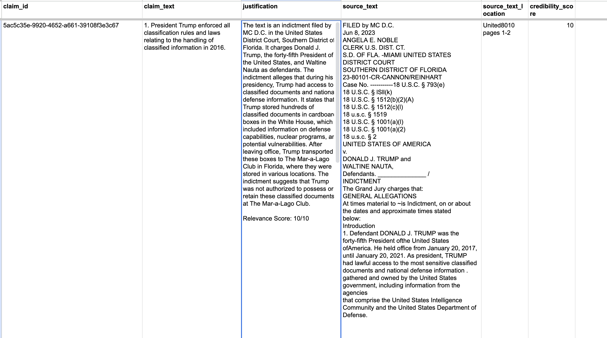

## AlternativeFacts


This is a project from ScaleAI's Generative AI Hackathon on July 15, 2023.

**Contributors:** Glenn Parham, Josh Marks, Parul Singh, Jim Salsman

AlternativeFacts is an open-source python package that verifies the veracity of LLM-generated text against internal documents & the internet.

LLM-generated content needs to be properly sourced & cited. In the context of the Department of Defense & Intelligence Community, this is especially true. Given that many end-users in DoD are non-technical, it’s critical that we provide these supplemental citations.

Currently, AlternativeFacts has the capacity to verify the veracity of claims against both internal (documents, pdfs, etc.) and external (wikipedia, google) data sources.

This leverages the pre-existing open-source project: [paperQA](https://github.com/whitead/paper-qa), which does the heavy lifting of vectorizing documents into embeddings and consequently running queries against them. AlternativeFacts extends this library by:

1. Decomposing the various claims embedded in LLM-generated text
2. Fetching relevant information from the internet
3. Transposing the outputs of paperQA into an interpretable csv

Our work can be found publicly here: https://github.com/glennparham/AltFacts

### Getting Set Up

**Note:** To run this project, you'll need to have an OpenAI API key. You can get one [here](https://beta.openai.com/).

1. Initialize up your python virutal env:

   `python3 -m venv myenv`

2. Activate your virtual env:

   `source myenv/bin/activate`

3. Install the requirements:

   `pip install -r requirements.txt`

4. Run main.py

   `python3 main.py`

## Optimal Process

We built this during a hackathon, but if we had more time we'd like to enable the following flow:

1. Pass to AltFacts the text you'd like to be verified.
2. AltFacts uses [paperQA](https://github.com/whitead/paper-qa) to identify relevant citations (if applicable).
3. We transpose these citations into a pandas dataframe.
4. We run meta-analysis of these citations to determine (source credibility, bias, etc.)

## Using AltFacts

```python
import AltFacts

source_documents = ["test.pdf"]

generated_text = "Jane went to the store on Tuesday.  She bought a banana.  She ate it."

AltFacts(generated_text, source_documents)

print("\n⌛ Now extracting the claims of the generated text...\n")
altfacts_instance.extract_claims()
print("✅ Extracted Claims:\n", altfacts_instance.get_extracted_claims_str())

## Iterate over the claims and pass through paperqa
print("\n\n⌛ Now verifying the claims...")
answers = altfacts_instance.answer_claims()

print("\n\n✅ Claims have been verified!")

print("\n⌛Now writing verifications to CSV...\n")
altfacts_instance.generate_pandas_dataframe()

print("\n\n✅ CSV has been generated!\n")
```

This should generate a CSV that looks like this:


## Sample PDFs

- [Trump's Indictment](https://www.justice.gov/storage/US_v_Trump-Nauta_23-80101.pdf)
