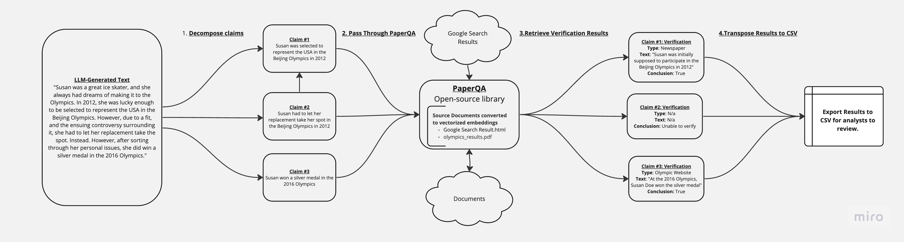

## AlternativeFacts

This is a project from ScaleAI's Generative AI Hackathon on July 15, 2023.

Contributors: Glenn Parham, Josh Marks, Parul Singh, Jim Salsman

1. AlternativeFacts is an open-source python package that verifies the veracity of LLM-generated text against internal documents & the internet.
2. LLM-generated content needs to be properly sourced & cited. In the context of the Department of Defense & Intelligence Community, this is especially true. Given that many end-users in DoD are non-technical, it’s critical that we provide these supplemental citations.
3. Currently, AlternativeFacts has the capacity to verify the veracity of claims against both internal (documents, pdfs, etc.) and external (wikipedia, google) data sources.
4. This leverages the pre-existing open-source project: paper-qa. This project does the heavy lifting of vectorizing documents into embeddings and consequently running queries against them. AlternativeFacts extends this library by (1) decomposing the various claims embedded in LLM-generated text as well as (2) transposing the outputs of paper-qa into an interpretable csv.
5. Our work can be found publicly here: https://github.com/glennparham/AltFacts

### How To Run

1. Initialize up your python virutal env:

   `python3 -m venv myenv`

2. Activate your virtual env:

   `source myenv/bin/activate`

3. Install the requirements:

   `pip install -r requirements.txt`

4. Run main.py

   `python3 main.py`

## Process

1. Pass to AltFacts the text you'd like to be verified.
2. AltFacts uses [paperQA](https://github.com/whitead/paper-qa) to identify relevant citations (if applicable).
3. We transpose these citations into a pandas dataframe.
4. We run meta-analysis of these citations to determine (source credibility, bias, etc.)

## Sample PDFs

- [Trump's Indictment](https://www.justice.gov/storage/US_v_Trump-Nauta_23-80101.pdf)
